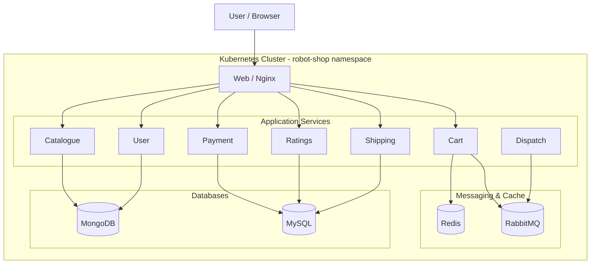
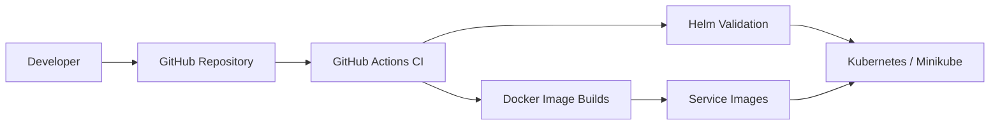

# Three-Tier Microservices Deployment with Kubernetes & Helm


A containerized microservices application deployed and managed using Docker, Kubernetes, Helm, and GitHub Actions.

This project is based on **Stan's Robot Shop**, an open-source microservices sample originally created by Instana. I forked the project and extended it as a hands-on DevOps/Kubernetes project by implementing Kubernetes configuration improvements, Helm customization, secret-based credential management, scaling, self-healing validation, persistent storage testing, resource monitoring, and CI validation.

> **Attribution:** The underlying Robot Shop application and its original microservices are from the Instana Robot Shop project. This repository documents my deployment, configuration, DevOps, and infrastructure work on top of that project.

---

## Architecture



### Kubernetes Architecture



---

## Project Highlights

### Containerization
- Dockerized microservices architecture
- Docker Compose support for local development
- Individual Dockerfiles for application services
- Tested Docker image builds locally and through GitHub Actions

### Kubernetes
- Deployed the complete Robot Shop application to Kubernetes
- Used a dedicated `robot-shop` namespace
- Configured Kubernetes Deployments, Services and StatefulSets
- Used ClusterIP services for internal service communication
- Exposed the web frontend using a NodePort service
- Verified Kubernetes service discovery between microservices

### Helm
- Customized the existing Helm chart
- Added configurable catalogue replicas
- Added a ConfigMap for catalogue MongoDB configuration
- Added Kubernetes Secret references for Ratings database credentials
- Parameterized application configuration through `values.yaml`
- Validated the chart using `helm lint` and `helm template`

### Security
- Removed the hardcoded Ratings database password from source code
- Moved Ratings database credentials to a Kubernetes Secret
- Injected the password into workloads using `secretKeyRef`
- Updated MySQL initialization to consume the password through an environment variable
- Verified that the previous hardcoded password no longer exists in the Git repository

### Reliability & Kubernetes Operations
- Scaled the Catalogue deployment from 1 to 3 replicas
- Verified Kubernetes self-healing by deleting a running pod and observing automatic replacement
- Performed Kubernetes rollout updates
- Tested deployment rollback using Kubernetes rollout history
- Configured readiness probes for application health checks

### Persistent Storage
- Redis uses a Kubernetes PersistentVolumeClaim
- Verified that Redis data survives pod deletion and recreation
- PVC configured with 1 GiB storage using the Kubernetes `standard` StorageClass

### Monitoring
- Enabled Kubernetes Metrics Server
- Used `kubectl top pods` to inspect CPU and memory usage
- Verified resource consumption across application services
- Robot Shop also exposes Prometheus-compatible metrics endpoints for selected services

### CI/CD
GitHub Actions automatically validates the project on pushes and pull requests.

The CI pipeline performs:

1. Helm lint validation
2. Helm template rendering
3. Catalogue Docker image build
4. Ratings Docker image build
5. MySQL Docker image build

Workflow:

```text
Git Push
   │
   ▼
GitHub Actions
   │
   ├── Helm Lint
   ├── Helm Template
   │
   ├── Build Catalogue
   ├── Build Ratings
   └── Build MySQL
```

---

## Technology Stack

| Category | Technologies |
|---|---|
| Containers | Docker |
| Container Orchestration | Kubernetes |
| Package Management | Helm |
| CI/CD | GitHub Actions |
| Frontend | AngularJS / Nginx |
| Backend | Node.js, Python, Java, Go, PHP |
| Databases | MongoDB, MySQL |
| Cache | Redis |
| Messaging | RabbitMQ |
| Local Kubernetes | Minikube |
| Monitoring | Kubernetes Metrics Server |
| Configuration | ConfigMaps |
| Secrets | Kubernetes Secrets |
| Version Control | Git / GitHub |

---

## Microservices

The application contains multiple independent services:

- Web
- Catalogue
- User
- Cart
- Shipping
- Payment
- Ratings
- Dispatch
- MongoDB
- MySQL
- Redis
- RabbitMQ

Each service communicates through Kubernetes service discovery.

For example:

```text
web
 │
 └── catalogue:8080
        │
        └── mongodb:27017
```

Kubernetes DNS allows services to communicate using service names instead of hardcoded IP addresses.

---

# Running Locally with Docker Compose

Make sure Docker and Docker Compose are installed.

Start the application:

```bash
docker compose up -d
```

Check the running containers:

```bash
docker compose ps
```

Access the application:

```text
http://localhost:8080
```

Stop the application:

```bash
docker compose down
```

---

# Deploying to Kubernetes with Helm

## 1. Start Minikube

```bash
minikube start --driver=docker
```

Verify:

```bash
kubectl get nodes
```

## 2. Create the namespace

```bash
kubectl create namespace robot-shop
```

## 3. Install the Helm chart

```bash
helm install robot-shop K8s/helm -n robot-shop
```

Check deployments:

```bash
kubectl get deployments -n robot-shop
```

Check pods:

```bash
kubectl get pods -n robot-shop
```

Check services:

```bash
kubectl get svc -n robot-shop
```

## 4. Access the application

```bash
minikube service web -n robot-shop --url
```

Open the displayed URL in a browser.

---

# Helm Validation

Before deployment, validate the chart:

```bash
helm lint K8s/helm
```

Render the Kubernetes manifests:

```bash
helm template robot-shop K8s/helm
```

---

# Scaling

The Catalogue service can be horizontally scaled:

```bash
kubectl scale deployment catalogue \
  --replicas=3 \
  -n robot-shop
```

Verify:

```bash
kubectl get deployment catalogue -n robot-shop
```

Expected:

```text
3/3
```

Check the service endpoints:

```bash
kubectl get endpoints catalogue -n robot-shop
```

---

# Self-Healing

Kubernetes automatically recreates failed pods.

Example:

```bash
kubectl get pods -n robot-shop
```

Delete a Catalogue pod:

```bash
kubectl delete pod <catalogue-pod> -n robot-shop
```

Then check:

```bash
kubectl get pods -n robot-shop
```

Kubernetes creates a replacement pod automatically.

---

# Rollouts and Rollbacks

View rollout history:

```bash
kubectl rollout history deployment/catalogue -n robot-shop
```

Check a specific revision:

```bash
kubectl rollout history deployment/catalogue \
  --revision=2 \
  -n robot-shop
```

Rollback:

```bash
kubectl rollout undo deployment/catalogue \
  --to-revision=2 \
  -n robot-shop
```

Verify:

```bash
kubectl rollout status deployment/catalogue -n robot-shop
```

---

# Resource Monitoring

Enable Metrics Server in Minikube:

```bash
minikube addons enable metrics-server
```

View pod resource usage:

```bash
kubectl top pods -n robot-shop
```

View node resource usage:

```bash
kubectl top nodes
```

---

# Persistent Storage

Redis uses a PersistentVolumeClaim.

Check:

```bash
kubectl get pvc -n robot-shop
```

Example:

```text
data-redis-0
```

The Redis StatefulSet mounts persistent storage at:

```text
/mnt/redis
```

This allows Redis data stored on the mounted volume to survive pod recreation.

---

# Configuration Management

The Catalogue service uses a Kubernetes ConfigMap for its MongoDB connection string.

Check:

```bash
kubectl get configmap catalogue-config -n robot-shop
```

The configuration contains:

```text
MONGO_URL=mongodb://mongodb:27017/catalogue
```

This keeps environment-specific configuration outside the application image.

---

# Secret Management

Ratings database credentials are supplied through a Kubernetes Secret.

Check:

```bash
kubectl get secret ratings-db -n robot-shop
```

The Ratings deployment reads:

```text
DB_USER
DB_PASSWORD
```

from the Secret using `secretKeyRef`.

The MySQL deployment also consumes the database password through the same Secret.

No plaintext database password is stored in the application source code.

> For production environments, an external secret manager such as AWS Secrets Manager, HashiCorp Vault, or another Kubernetes secret-management solution would be preferable.

---

# GitHub Actions CI

The repository contains:

```text
.github/workflows/ci.yml
```

The workflow runs on pushes and pull requests targeting `master`.

Pipeline stages:

```text
                    ┌───────────────┐
                    │ GitHub Push   │
                    └───────┬───────┘
                            │
                            ▼
                    ┌───────────────┐
                    │ Validate Helm │
                    └───────┬───────┘
                            │
              ┌─────────────┼─────────────┐
              ▼             ▼             ▼
        Catalogue        Ratings         MySQL
        Docker Build     Docker Build    Docker Build
              │             │             │
              └─────────────┼─────────────┘
                            ▼
                       CI Result
```

The current pipeline does not push images to a registry. It validates that the Docker images can be successfully built.

---

# Useful Kubernetes Commands

View all resources:

```bash
kubectl get all -n robot-shop
```

View pod details:

```bash
kubectl describe pod <pod-name> -n robot-shop
```

View application logs:

```bash
kubectl logs deployment/catalogue -n robot-shop
```

Execute a command inside a container:

```bash
kubectl exec -it <pod-name> -n robot-shop -- /bin/sh
```

View service endpoints:

```bash
kubectl get endpoints -n robot-shop
```

---

# Project Structure

```text
three-tier-architecture-demo/
│
├── .github/
│   └── workflows/
│       └── ci.yml
│
├── K8s/
│   └── helm/
│       ├── templates/
│       ├── values.yaml
│       └── Chart.yaml
│
├── catalogue/
├── cart/
├── dispatch/
├── payment/
├── ratings/
├── shipping/
├── user/
├── web/
│
├── mysql/
├── mongodb/
├── redis/
├── rabbitmq/
│
└── README.md
```

---

# What I Implemented

The main DevOps and Kubernetes work performed in this repository includes:

- Customized Helm deployments and values
- Added configurable Catalogue replicas
- Added Catalogue ConfigMap configuration
- Implemented Kubernetes Secret-based Ratings credentials
- Removed hardcoded database credentials from source
- Updated MySQL initialization to consume credentials from environment variables
- Built and tested Docker images locally
- Added GitHub Actions CI
- Added MySQL, Ratings and Catalogue image builds to CI
- Removed the legacy Docker Compose GitHub Actions workflow
- Deployed the application to Minikube
- Tested Kubernetes service discovery
- Tested horizontal scaling
- Tested Kubernetes self-healing
- Tested rollout history and rollback
- Enabled Metrics Server
- Monitored pod resource consumption
- Verified Redis persistent storage across pod recreation

---

# Future Improvements

Possible next steps for production-style deployment include:

- Terraform infrastructure as code
- AWS EKS deployment
- GitHub Actions image publishing to Amazon ECR or GHCR
- Continuous deployment to Kubernetes
- Prometheus and Grafana dashboards
- Container vulnerability scanning
- Kubernetes NetworkPolicies
- Non-root containers
- Resource requests and limits for all services
- Persistent storage for MongoDB and MySQL
- External secret management
- Ingress and TLS
- Horizontal Pod Autoscaling
- Centralized logging

---

# Original Project

This project uses the Robot Shop sample application originally developed by Instana.

The original project was designed as a sandbox for learning container orchestration and monitoring with a multi-service application.

This repository extends that foundation with additional Kubernetes, Helm, security, reliability, monitoring, and CI/CD work.

Original project:

https://github.com/instana/robot-shop

---

## Author

**Agarshal**

B.Tech Artificial Intelligence & Data Science

GitHub:

https://github.com/Agarshal
